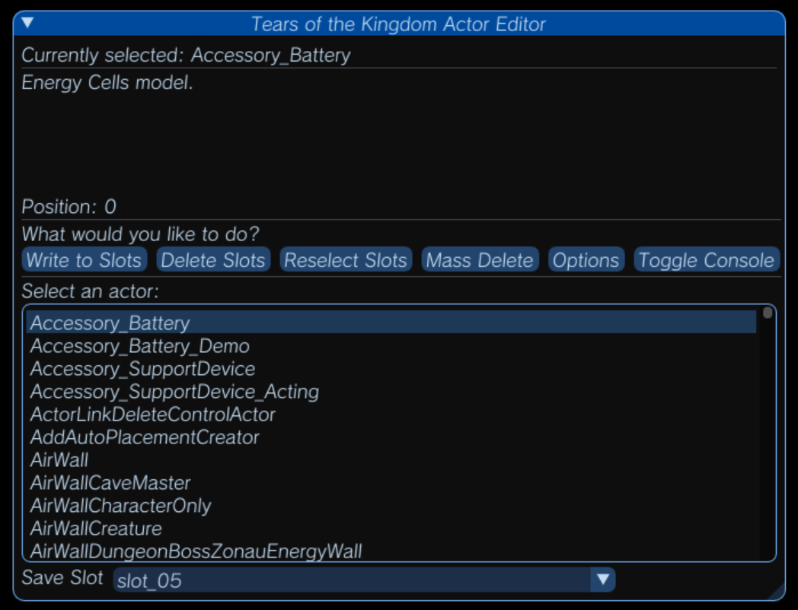

# TOTKActorEditor
**For Tears of the King versions 1.1.0 - 1.2.1**

TOTKActorEditor is an actor editor for The Legend of Zelda: Tears of the Kingdom. This tool accesses TOTK save files and changes actor IDs within it. Intended with emulator use in mind, but also works on Switch using save backups.

# Disclaimer
This tool will edit the save file you provide it, meaning that any changes that you make while editing your save file is irreversable. It may also cause corruption to a save file if any issue arises.
**Please make any backups on your save file before using.**

# Installation
You can download the latest version of TOTKActorEditor [here](https://github.com/accountrev/TOTKActorEditor/releases/latest).

You'll need .NET 7 to run this application.
[Microsoft .NET SDK 7](https://dotnet.microsoft.com/en-us/download/dotnet/7.0)

## Building

### Dependancies
-   [ImGui.NET](https://www.nuget.org/packages/ImGui.NET)
-   [ClickableTransparenOverlay](https://www.nuget.org/packages/ClickableTransparentOverlay)
-   [Veldrid.ImGui](https://www.nuget.org/packages/Veldrid.ImGui/)
-   [Vortice.Mathematics](https://www.nuget.org/packages/Vortice.Mathematics/)
-   [NAudio](https://www.nuget.org/packages/NAudio/)

You may need to setup a new project with these dependancies as this project was not written in Visual Studio.

# Usage
Please view the [Wiki](https://github.com/accountrev/TOTKActorEditor/wiki) to see how to use the program, and other important information.
